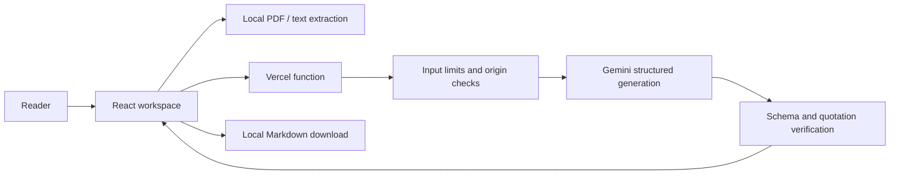

# Margin

Make sense of the fine print. An evidence-grounded assistant for **AI for Legal Assistance & Access**.

## Live Demo

[Open Margin](https://margin-legal-assistant.vercel.app) · [Public repository](https://github.com/Ritesh-Root/legalBuddy)

The guided sample requires no API key. Live analysis uses a server-side Gemini key and displays an explicit unavailable state if it is not configured.

Try the fictional freelancer agreement in about two minutes:

1. Click **Explore the sample**, then **View in document** on the ownership finding.
2. Filter **Discuss first** to see the payment and ownership questions.
3. Open **Compare versions**, then **View in revised document** to inspect the changed payment wording and the inconsistent termination clause.
4. Open **Ask a question** and choose **Can I show this in my portfolio?**
5. Open **Your lawyer brief** and **Download brief** to take the source quotations and preparation checklist to a professional.

For live inference, click **New document**, paste or upload readable agreement text, add reader context, check the processing consent, and click **Make it clear**. The sample text is available in [src/domain/sample.ts](src/domain/sample.ts) for a privacy-safe live trial.

## Problem Statement Alignment

| ID  | Requirement                                               | Implementation                                                               |
| --- | --------------------------------------------------------- | ---------------------------------------------------------------------------- |
| R1  | Simplifying complex legal documents                       | Plain-language review with verified source quotations                        |
| R2  | Comparing contracts, agreements, or policies              | Original/revised analysis with explicit source labels                        |
| R3  | Highlighting clauses, obligations, risks, inconsistencies | Prioritized findings and obligation checklist                                |
| R4  | Answering questions based on documents                    | Grounded Q&A with evidence and uncertainty                                   |
| R5  | Helping users understand options and next steps           | Context-aware questions and preparation steps                                |
| R6  | Generating actionable outputs                             | Downloadable Markdown lawyer briefing                                        |
| R7  | Assistance rather than professional legal advice          | Clear scope notice, no enforceability verdicts, missing information surfaced |

## Chosen Vertical

Legal assistance and access, initially for freelancers and individuals reading everyday agreements before speaking with a legal professional.

## Approach and Logic

Validate input, attach reader context, request structured model output, verify quotations against the exact source, and display findings beside the document. Reject unsupported evidence. Sample content is explicitly labeled and separate from live analysis.

## How the Solution Works

Add a document, set your role and jurisdiction, consent to AI processing, and start a review. Explore findings, compare a revision, ask a question, and prepare a downloadable brief.

## Assumptions Made

- Contract text is evidence, not a source of trusted instructions.
- The app explains document wording; it does not research applicable law or determine enforceability.
- Text-based PDF and UTF-8 text are supported; scans require OCR elsewhere.
- Limits: 2 MB, 30 PDF pages, and 80–40,000 characters per document. Missing information and unsupported questions are stated explicitly.
- No account or document database is needed. The browser keeps the current workspace in memory.
- Event rules supplied by the participant: at most 3 submission attempts, public repository, one branch, repository below 10 MB. Building and deploying does not submit an evaluation attempt.

## Features

Document review, version comparison, document questions, evidence navigation, obligations, and lawyer briefing.

## Architecture

## Tech Stack

React, TypeScript, Vite, Zod, Gemini, Vercel, Vitest, Playwright, and axe.

## Getting Started

Node.js 24 is required. Run `npm ci`, copy `.env.example` to `.env.local`, set `GEMINI_API_KEY`, then run `npm run dev`. Open the local address printed by Vite. The API runs on port 3001 through Vite's same-origin proxy.

Production uses Vercel with `GEMINI_API_KEY` in the project's production environment. `GEMINI_MODEL` defaults to `gemini-2.5-flash`. `npm run build` creates the client and verifies emitted server modules in plain Node; this catches unresolved ESM imports that a TypeScript-only check misses. `/api/health` and `/healthz` return JSON readiness information, including whether a key is configured.

## Testing

`npm run verify` runs lint, strict type checking, measured coverage, the production client/API build, an emitted-Node runtime smoke test, and formatting. `npm run test:e2e` runs desktop/mobile journeys and axe accessibility checks. Install Chromium with `npx playwright install chromium`, or set `PLAYWRIGHT_CHANNEL=chrome` to use installed Chrome. `npm run preflight` checks tracked-file size, branch count, secret signatures, and submission documentation. CI runs these checks and dependency audits on every push.

Measured on 14 September 2026:

- 41 unit/API tests passed, including input limits, consent, origin handling, rate and concurrency limits, cancellation, private result reuse, safe Markdown export, PDF extraction budgets, provider failures, exact source matching, and property-based Unicode normalization.
- Server/domain coverage: **100% lines (145/145)**, **100% statements/functions**, **94.28% branches (99/105)**. This is the configured server/domain scope in [vitest.config.ts](vitest.config.ts), not UI coverage.
- 18 E2E tests passed across desktop and mobile, including local PDF extraction/rejection, cancelled-request recovery, private result reuse/reset, tab draft retention, escaped model output, comparison, questions, export, keyboard navigation, and axe scans.
- Production and full-tree dependency audits reported zero vulnerabilities.
- The deployed Gemini review, comparison, and Q&A all passed schema and exact-source checks. Health returned `200` with `aiConfigured: true`; method errors and static policy files returned their expected response bodies. A production browser inspection found no console errors or CSP violations.

`npm run test:live` is an opt-in test of the real deployed provider using only the public fictional sample. It makes three potentially billable calls and validates review, comparison, and Q&A schemas and source quotations. Set `LIVE_ACTIONS=compare,ask` to select actions, or `E2E_BASE_URL` to test another deployment. Offline E2E tests mock live inference; this separate test checks the real integration. Provider availability and model outputs can vary; invalid evidence is withheld and the user may retry.

## Security

API keys are server-only. Input and output are validated; document instructions are untrusted. No document bodies are logged or persisted by the app. AI processing sends extracted text to the configured provider after consent. Downloaded briefs encode untrusted Markdown syntax, while the app displays model output as React text. CI actions are pinned to commit hashes; a checksum-verified Gitleaks scan checks the full Git history with redacted findings.

## Performance

Static application assets use compression and immutable caching for hashed files. PDF parsing and workspace panels load lazily; PDF extraction stops as soon as the text budget is exceeded. A request processes at most two 40,000-character documents with a 40-second provider timeout and 5,000 output tokens; requests are not retried automatically. Each warm function instance permits at most three simultaneous generations. Local extraction and brief generation need no provider call.

Successful, identical requests can reuse one of at most eight results within the current workspace for five minutes. The complete document, revision, question, context, action, and consent form the key. Clearing or leaving the workspace clears reuse; failed and aborted results are not stored. There is no shared server cache or browser persistence. Request cancellation propagates to the Gemini SDK, but cannot guarantee that provider processing or billing stops. See [security and efficiency verification](docs/verification.md) for measured savings and regression evidence.

Lighthouse 13.4.1 measured the production landing page on 13 September 2026: **Performance 98, Accessibility 100, Best Practices 100, SEO 100** (mobile simulation). These are a single lab run, not a guarantee across devices or networks. The three live sample API calls took approximately 8.2 seconds for review, 12.4 seconds for comparison, and 3.9 seconds for Q&A in the verified run; provider latency varies.

## Accessibility

Semantic landmarks, labeled controls, visible keyboard focus, source navigation, async announcements, and reduced-motion support.

## Evaluation Evidence

| Criterion                   | Impact | Implementation and verification                                                                                                                                                                                                              |
| --------------------------- | ------ | -------------------------------------------------------------------------------------------------------------------------------------------------------------------------------------------------------------------------------------------- |
| Code Quality                | High   | Strict [TypeScript](tsconfig.json), typed [ESLint](eslint.config.js), focused [feature modules](src/features), [architecture decisions](docs/decisions.md), and [CI](.github/workflows/ci.yml)                                               |
| Problem Statement Alignment | High   | R1–R7 above; [review](src/features/review/review-panel.tsx), [comparison](src/features/workspace/compare-panel.tsx), [Q&A](src/features/workspace/question-panel.tsx), and [brief](src/domain/brief.ts) connected in one workspace           |
| Security                    | Medium | [Threat model](SECURITY.md), [request validation](server/request.ts), [quotation verification](src/domain/evidence.ts), [server-only Gemini adapter](server/provider.ts), [headers](vercel.json), and [CodeQL](.github/workflows/codeql.yml) |
| Efficiency                  | Medium | [Lazy PDF worker](src/features/documents/pdf-reader.ts), [lazy panels](src/features/workspace/workspace-panels.tsx), [bounded inference](server/provider.ts), and [rate limits](server/rate-limit.ts)                                        |
| Testing                     | Low    | [Unit/API tests](tests/unit), [browser regressions](tests/e2e/regressions.spec.ts), [browser journeys](tests/e2e/workspace.spec.ts), [runtime test](scripts/runtime-smoke.mjs), and [live test](scripts/live-smoke.ts)                       |
| Accessibility               | Low    | axe scans in browser journeys, semantic controls, keyboard source navigation, responsive layouts, reduced motion, and jsx-a11y lint rules                                                                                                    |

## Google AI Integration

Gemini generates document explanations, version comparisons, and grounded answers through the official `@google/genai` SDK in [server/provider.ts](server/provider.ts). The model receives reader context and untrusted document text under fixed [instructions](server/prompt.ts); schema and exact-quotation checks run before anything is returned to the browser. Vercel hosts the app as requested; no document database or additional cloud service is required.

## Team

Built by Ritesh with Codex for PromptWars.
